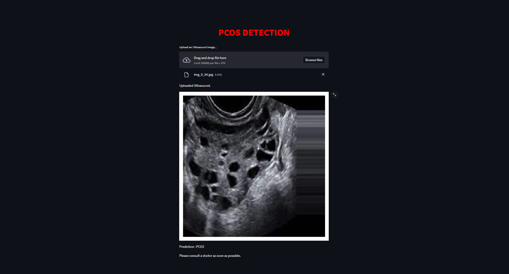
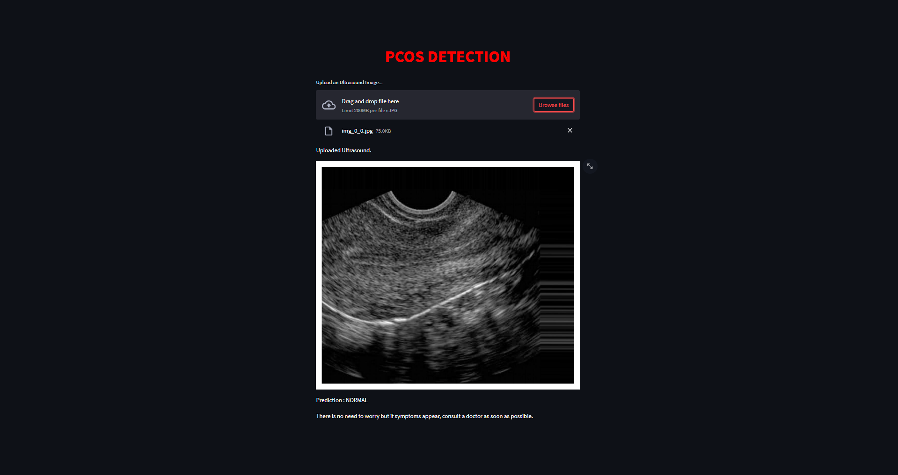

# PCOS Detection Model

### This repository contains code to create a PCOS (Polycystic Ovary Syndrome) detection model using XGBoost and VGG16 pre-trained model.

### Dataset used: [PCOS DATASET](https://www.kaggle.com/datasets/anaghachoudhari/pcos-detection-using-ultrasound-images)

<hr>

## Model Creation Steps:

1. **Dataset Collection**:
   Gathered a dataset containing images for PCOS detection. The dataset should be organized into 'train' and 'test' sets.

2. **Preprocessing**:
   Utilized OpenCV and NumPy to read, resize, and process images.
   Imported the necessary libraries including NumPy, Matplotlib, OpenCV, TensorFlow, XGBoost, and others.

3. **Data Preprocessing**:
   Defined functions for loading and preprocessing images from the 'train' and 'test' directories.
   Normalized pixel values of the images by dividing by 255.0 to scale them between 0 and 1.

4. **Feature Extraction**:
   Used the VGG16 pre-trained model as a feature extractor to obtain features from the images in both 'train' and 'test' datasets.
   Extracted features and reshaped them into a suitable format for training and testing the XGBoost classifier.

5. **Model Training**:
   Implemented an XGBoost classifier to train on the extracted features from the 'train' dataset.
   Encoded labels using LabelEncoder from the scikit-learn library to convert text labels to integer format.
   Trained the XGBoost model using the extracted features and their respective labels.

6. **Model Evaluation**:
   Evaluated the trained model using the 'test' dataset.
   Calculated accuracy and generated a confusion matrix to visualize the performance of the model.
   Produced a classification report to further assess the model's performance.

7. **Model Saving**:

   - Saved the trained XGBoost model using joblib for future use.
   - Prerequisites:
     - Python 3.x
     - Required libraries: NumPy, Matplotlib, OpenCV, TensorFlow, XGBoost, scikit-learn, Seaborn

8. **Model Deployment**
   - Deployed the model using Streamlit.
   - When a image is passed as a input to the streamlit app, the feature extraction of the image is done using the VGG16 model and the extracted features are passed to the XGBoost model for prediction.

### Steps to Run the Code:

- Ensure all necessary libraries are installed by running:

```python
    pip install -r requirements.txt.
```

- Prepare the dataset in the required directory structure ('train' and 'test' directories).
- Run the script to train the model:

```python
    python main.py
```

- The trained model will be saved as 'xray.pkl'.
- Use the model for predictions or further analysis.
- To run the webapp, run the following command:

```python
    streamlit run webapp.py
```

<hr>

### Model Information:

- Model: XGBoost Classifier
- Base Model: VGG16 (pre-trained on ImageNet)
- Files Included:
  main.py: Contains the code to create and train the PCOS detection model.
- xray.pkl: The trained XGBoost model.
  requirements.txt: Lists the required Python libraries and their versions.
- webapp.py : Contains the code to deploy the model using streamlit.

### Screenshots:

- Webapp:

  - Case "PCOS Positive":
    

  - Case "PCOS Negative":
    
